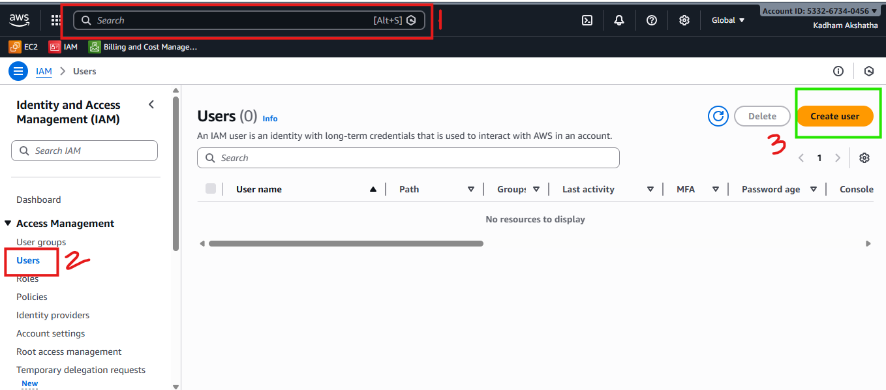
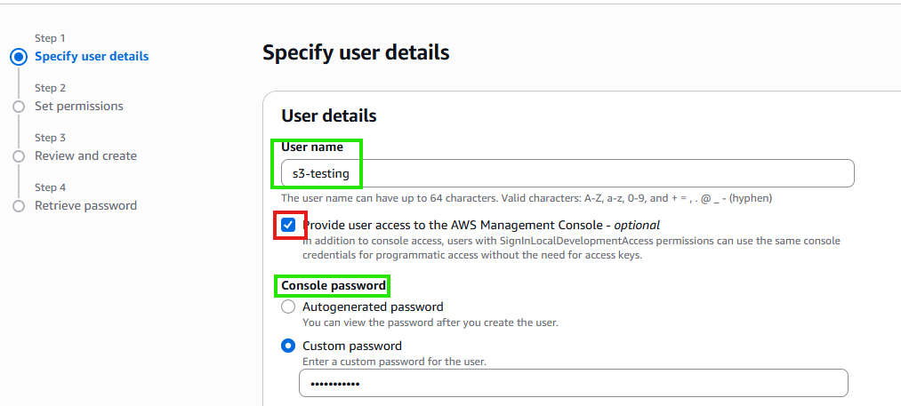
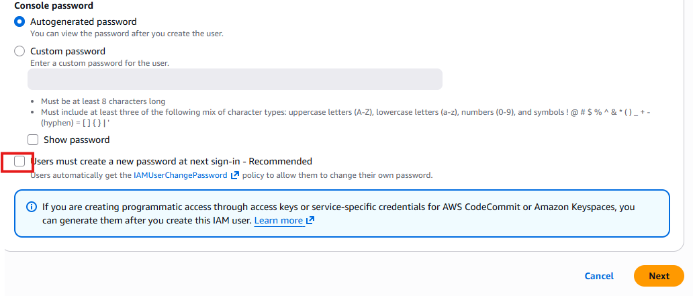
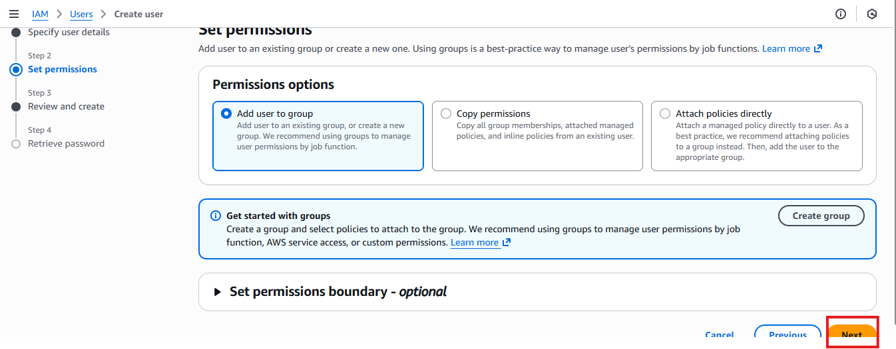
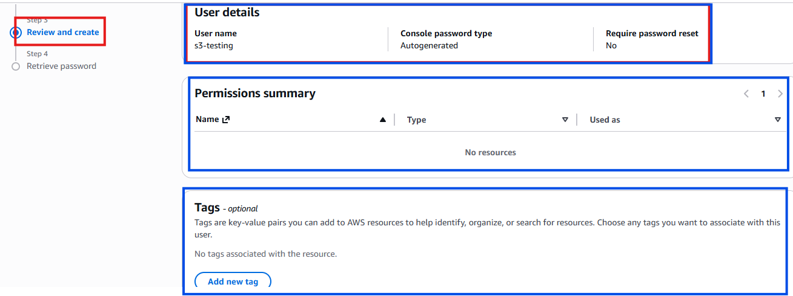
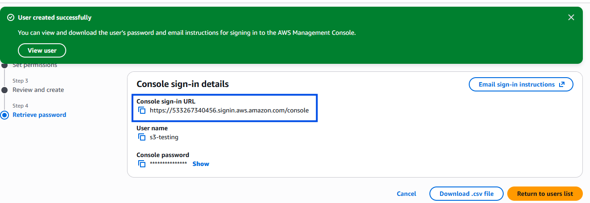
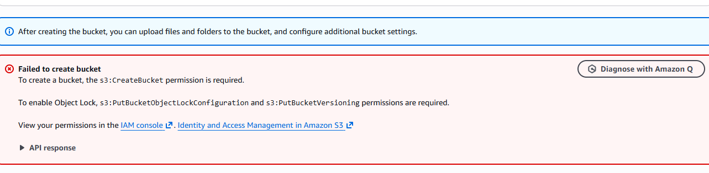
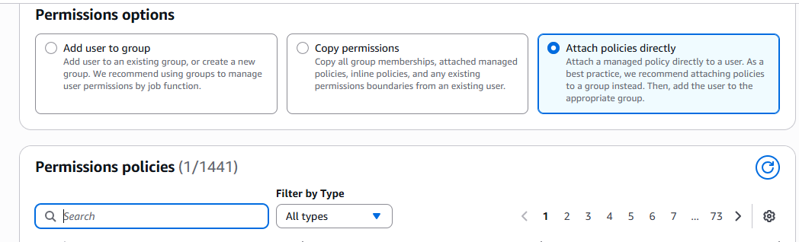
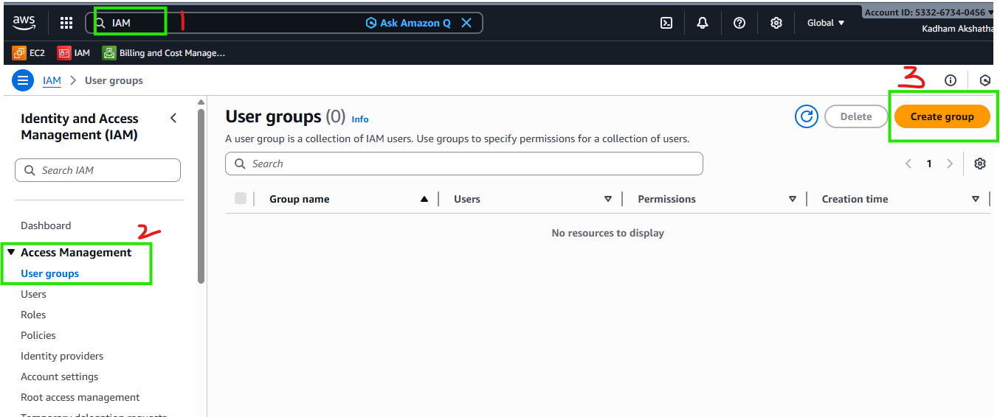

# AWS Basics for DevOps

## IAM - Identity And Access Management

IAM defines who does what in AWS. Basically it will make your work easier, when you have to give access to certain group of people like such as what the finance team can do in AWS, or the developers team can do in AWS, and apart form those tasks they will not be able to do other things.

So, in short it allows you to manage identites and permissions and it is a free service. And everything you do is gated thorugh IAM.

Lets see a few **building blocks** of IAM:

1. IAM Users

2. IAM Groups

3. IAM Policies

4. IAM Roles

### IAM Users:

If you want to give access to persons in your company to the AWS console, you will need to create the user in the console and that user is called IAM user. You might have testers, developers, finance team members, and for each user you need to create a username and a password. This is giverned by IAM users.

- IAM user has a username and password and they have access to console(console means dashboard of AWS)

- They can have access keys. These are the secret keys by using which developers can access AWS resources using command line.

### IAM Groups:

It is a collection of users with shared permissions. 

Lets say you have many devs in your org and you want to give some perimissions to them. So, giving them the permission individually will take time and it is not best practise also. So what you do is you create a group that group is called **IAM Groups** and then you assign a policy to the group and then you can add as many users you want, instead of giving them seperately.

Example:
Group: Developers -> Policy: PowerUserAccess
Group: Viewers -> Policy: ReadOnlyAccess.

### IAM Roles:

Lets say you have a service AWS Lambda, and it needs to interact with S3 bucket for some processing or work, but it is not possible for it to access S3 bucket, in that case you can create a temporary role and give permission to AWS Lambda so that it will interact with S3 bucket and then after the work is finished it will come back to its orginal state without the role.

It is a temporary access assumed by users, apps or services. 

- It doesn't require permenant access.
- Best practise for Lambda, EC2, EKS and CI/CD.

### IAM Policies:

IAM Policies are nothing but **Permissions** that are defined by you and can be used by Users, Roles and Groups.

- Policies are defined using JSON documents, so it is JSON like syntax.

## Creating IAM User:

To create an **IAM User** follow the below steps:

1. Go to AWS home dashboard and in the searchbar type **IAM** and then click on it.
2. Then on the left hand side select **Users** option.
3. Then on the right side click on **create user**

 

4. Then the page open like below and you need to provide **User Name** and then tick mark this option **"Provide user access to the AWS Management Console - optional"**. And then choose the password type(automatic generation or custom pwd)

5. If you are working on a procudtion environment and in the actual project make sure to tick this box **"Users must create a new password at next sign-in - Recommended"**. It is a good practise. Since my project is a exmaple one I am unticking this option and then go to next step.

6. In this page you will see **Set permissions** option where you can set the permissions accordingly. Since we are beginning the course we will leave it as it as then click on **next** option.

7. In this page you can review the details you have entered and also you have an option for **Tags** and then click on **Create User**.

Note: **Tags** are key-value pairs that are added by the person who is managing AWS account that helps you to identify, organise or search for resources

8. After the **IAM User** is created, test it on your end. Copy the url instance given by after creating the User and open a **Incognito Mode browser and then try to sign using the credentials given username and pwd.

9. You can see that after you login with that IAM user credentials you will be blocked form creating S3 buckets or EC2 instance or from viewing the Billing data. This is because the user hasn't got any permisisons yet.

## Adding Permissions to the IAM User:

1. Go to the User list in IAM -> click on users and click on the user.
2. You will see an option to give **permissions** click on that and add new permissions.
3. You will the options to give permissions. Now lets create a policy for the user to access S3 bucket.
4. So select **attach policies directly** option and then in the searchbar type "s3" and then you will get options, select the full S3 access for this user and then click on next and then click on **Add Permissions.**

5. After this you will be able to **create the S3 bucket** for this created user.

## Creating User Group:

1. Go to AWS Home Page -> search for IAM -> In Access Management select **User Groups**

