# **Git & GitHub**

## **Git**

Git is a **Distributed** version control system. Generally version control systems are of 2 types:
1. Centralized VCS.
2. Distributed VCS.

**Version Control System**

It is a software that records the changes made to source code that is related to the project. This helps in keeping track of project version chnages and helps developers to revert back to previous versions if anything goes wrong in current version. Without VCS the project becomes more disorganised with large number of files in it.

**Centralized VCS** 

It is a system which has a central repository that stores all the code and developers access this repo to make any changes. Examples for this are Subversion and CVS.
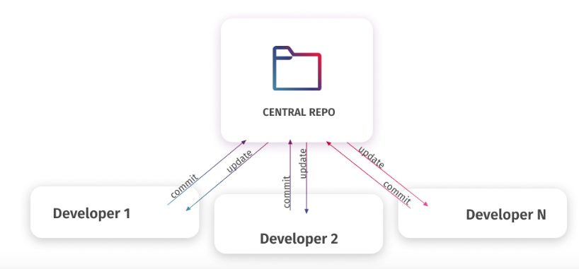

**Distributed VCS** 
It is a system where every developer has a complete local copy of the entire project and they can work offline. 
In DVCS each user has the mirroed copy of the entire entire project on their local machine.
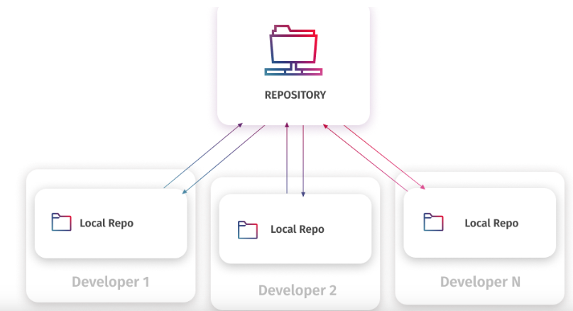

**Fork** 

It refers to a personal copy of the entire source code of your project. When you fork a repo, you will create a independent copy within your own account, so you can test your own changes without affecting the orginal project.

## **Git and GitHub Difference**

**Git** is a **software**, that tracks the changes made in source code during prject development.
It is designed for data integrity, and to maintain version tracking.
It is a command line tool.

**GitHub** is a **web based platform** that hosts git repos, and it allows developers to store and manage code online.
It has features like pull requests, issue tracking and team collaboration.
It is a graphical user interface.

## **Git Commands**

1. To create a git repo: **git init**
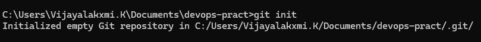

2. To check the status: **git status**
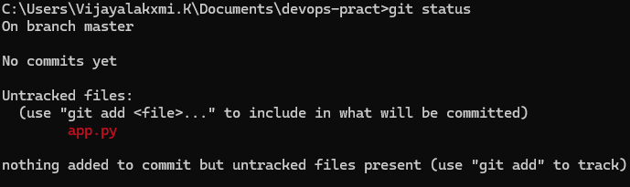

3. To add files to keep the track: **git add filename**
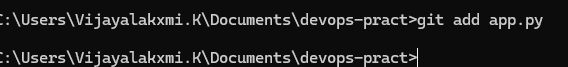

4. To remove/delete the file: **rm filename**
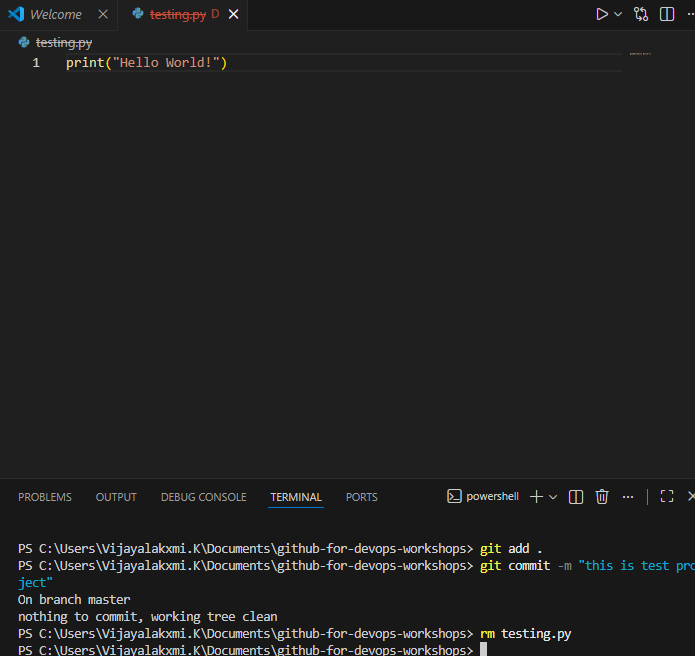
5. To restore the deleted file: **git restore filename**
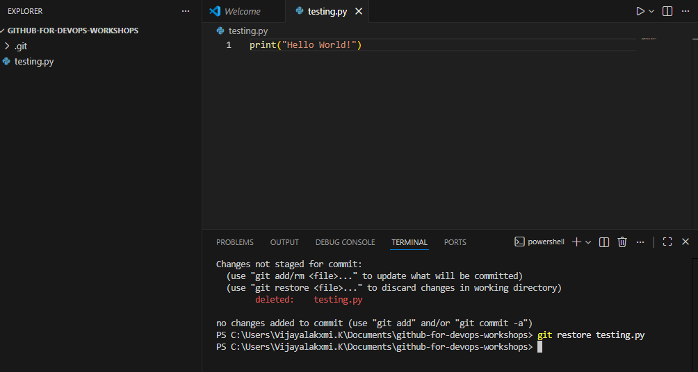

4. To know the exact changes made to the file: **git diff**
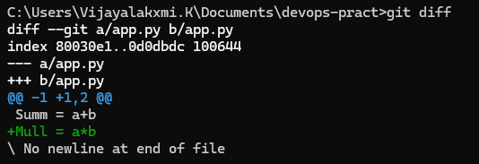

5. To keep track of the version changes you need to commit it: **git commit -m "This is my 1st version of app"**
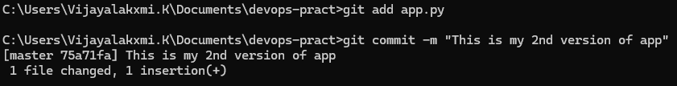

6. To know your versions of your code: **git log**
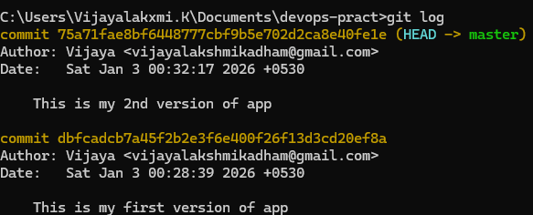
7. To go back to the previous version(keep the commit id from git log handy): **git reset --hard dbfcadcb7a45f2b2e3f6e400f26f13d3cd20ef8a

**Note: This is my commit id:dbfcadcb7a45f2b2e3f6e400f26f13d3cd20ef8a**
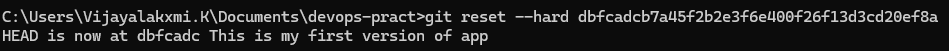

# Sharing a Local Git Project Using GitHub

## Introduction

We have created a **local copy of our project** using Git.  
All files, commits, and version history currently exist **only on the local system**.

However, in a real organization, projects are worked on by **multiple employees**, and the code needs to be **shared, collaborated on, and backed up**.

This is where **GitHub** comes into the picture.

## How to Share a Local Git Project to GitHub

### Step 1: Create a Repository on GitHub

- Log in to GitHub
- Create a new repository
- Choose:
  - Repository name
  - Public or Private visibility
- GitHub generates a **remote repository URL**

### Step 2: Link Local Repository to GitHub

Connect the local Git repository to the remote GitHub repository:

**git remote add origin <github-repository-url>**

This command tells Git where the remote repository is located.

### Step 3: Authenticate with Github

Github no longer supports **password** based authentication. So you can either use:
1. Personal Access Token(PAT) OR
2. SSH key

For since I am new to this I will be using PAT as it is convienient and later when I learn more I will try to use SSH Key.

Skip step 4 if you know how to create PAT:

### Step 4: Create Personal Access Token

- Go to your Github account
- Click on settings and then scroll down
- Select **Developer Settings**
- Here click on Personal Access Tokens and select **tokens(classic)**
- Click on **Generate new token** and select **Generate new token (classic)**
- Copy your token Id and go to your terminal and there type this command:
**git remote set-url origin https://YOURTOKENID@github.com/KadhamVj23/DevOps-Sample-Project.git**

**Note:** In place of YOURTOKENID replace your token Id.

### Step 5: Push Code to Github:

Now you can push the local commits to github using **git push origin master**

We are using **master** since it was in our local repo, in the next topic we will learn about **master and main branch.**
