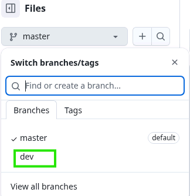
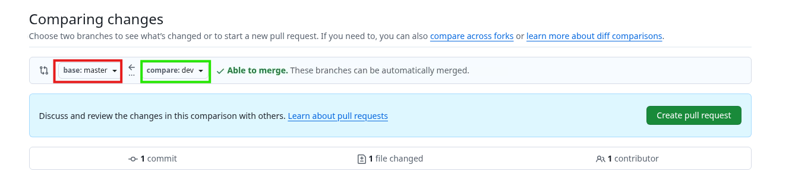

# **Git & GitHub**

## **Git**

Git is a **Distributed** version control system. Generally version control systems are of 2 types:
1. Centralized VCS.
2. Distributed VCS.

**Version Control System**

It is a software that records the changes made to source code that is related to the project. This helps in keeping track of project version chnages and helps developers to revert back to previous versions if anything goes wrong in current version. Without VCS the project becomes more disorganised with large number of files in it.

**Centralized VCS** 

It is a system which has a central repository that stores all the code and developers access this repo to make any changes. Examples for this are Subversion and CVS.


**Distributed VCS** 

It is a system where every developer has a complete local copy of the entire project and they can work offline. 
In DVCS each user has the mirroed copy of the entire entire project on their local machine.


**Fork** 

It refers to a personal copy of the entire source code of your project. When you fork a repo, you will create a independent copy within your own account, so you can test your own changes without affecting the orginal project.


## **Git and GitHub Difference**

**Git** is a **software**, that tracks the changes made in source code during prject development.
It is designed for data integrity, and to maintain version tracking.
It is a command line tool.

**GitHub** is a **web based platform** that hosts git repos, and it allows developers to store and manage code online.
It has features like pull requests, issue tracking and team collaboration.
It is a graphical user interface.


## **Git Commands**

1. To create a git repo: **git init**


2. To check the status: **git status**


3. To add files to keep the track: **git add filename**


4. To remove/delete the file: **rm filename**

5. To restore the deleted file: **git restore filename**


6. To know the exact changes made to the file: **git diff**


7. To keep track of the version changes you need to commit it: **git commit -m "This is my 1st version of app"**


8. To know your versions of your code: **git log**

9. To go back to the previous version(keep the commit id from git log handy): **git reset --hard dbfcadcb7a45f2b2e3f6e400f26f13d3cd20ef8a

**Note: This is my commit id:dbfcadcb7a45f2b2e3f6e400f26f13d3cd20ef8a**


## Sharing a Local Git Project Using GitHub

We have created a **local copy of our project** using Git.  
All files, commits, and version history currently exist **only on the local system**.

However, in a real organization, projects are worked on by **multiple employees**, and the code needs to be **shared, collaborated on, and backed up**.

This is where **GitHub** comes into the picture.

## How to Share a Local Git Project to GitHub

### Step 1: Create a Repository on GitHub

- Log in to GitHub
- Create a new repository
- Choose:
  - Repository name
  - Public or Private visibility
- GitHub generates a **remote repository URL**

### Step 2: Link Local Repository to GitHub

Connect the local Git repository to the remote GitHub repository:

**git remote add origin <github-repository-url>**

This command tells Git where the remote repository is located.

### Step 3: Authenticate with Github

Github no longer supports **password** based authentication. So you can either use:
1. Personal Access Token(PAT) OR
2. SSH key

For since I am new to this I will be using PAT as it is convienient and later when I learn more I will try to use SSH Key.

Skip step 4 if you know how to create PAT:

### Step 4: Create Personal Access Token

- Go to your Github account
- Click on settings and then scroll down
- Select **Developer Settings**
- Here click on Personal Access Tokens and select **tokens(classic)**
- Click on **Generate new token** and select **Generate new token (classic)**
- Copy your token Id and go to your terminal and there type this command:
**git remote set-url origin https://YOURTOKENID@github.com/KadhamVj23/DevOps-Sample-Project.git**

**Note:** In place of YOURTOKENID replace your token Id.

### Step 5: Push Code to Github:

Now you can push the local commits to github using **git push origin master**

**Note:** To pull the code from github to your local machine use: **git pull origin master**

We are using **master** since it was in our local repo, in the next topic we will learn about **branches** to understand more about it.

## **Branches and Branching Concept**


### **Branch:**

A **branch** is a separate line of work in a Git repository.

It allows developers to:
- Work on new features
- Fix bugs
- Experiment with changes  

without affecting the main code.

---

### Why Do We Use Branches?

Branches help to:
- Keep the main code stable
- Allow multiple people to work at the same time
- Test changes safely before merging

---

### Default (Root) Branch

The **default branch** (also called the root branch) is the main branch of the repository.

Today, the default branch is usually called **main**

Earlier it was commonly called **master**

---

## Local Repository vs GitHub Repository

### Local Repository
- When a repository is created locally using `git init`:
  - Older Git versions → default branch is `master`
  - Newer Git versions → default branch is `main`


### GitHub Repository
- When a repository is created on GitHub:
  - The default branch is **`main`**
- When you clone it, your local repository will also have `main`


---

### Important Note

> The branch name (`main` or `master`) depends on Git’s default configuration,  
> not on whether the repository is local or on GitHub.

---


### Best Practice

- Use **`main`** as the default branch
- Create separate branches for features and bug fixes
- Merge changes back into `main` after testing

---


### One-Line Summary

A branch is an independent line of development, and the default branch is commonly called `main`, previously known as `master`.

Git allows us to create **multiple branches** so that we can work on different changes **without affecting the main code**.

Each branch is an **independent line of development** as explained above.


---

### Default Branch (Main / Master)

- When a repository is created, it has a default (root) branch
- This branch is usually called:
  - `main` (modern standard)
  - `master` (older naming)

This branch contains the **stable version of the project**.

---

## Creating a New Branch

To create a new branch called `dev`, use:

```bash
git branch dev

```

### What happened above:

- A new branch named dev is created
- dev is an exact copy of the current branch (main/master)
- You are still on the main branch after this command

---

### Switching to the Dev Branch

To move from the main branch to the **dev* branch, use:

```bash
git switch dev
```
Now you are working inside **dev** branch.

To see which branch you are on: 
```bash
git branch
```

The branch with **stark(*)** indicates the current active branch.

After creating this **dev** branch you can make any modifications, or cretae any fiels in this branch and this will not affect the **main branch**

Now lets create a new file in this dev branch called **this-is-dev-branch-file.txt**

Now add this file and commit it and you can see the file in your dev branch, but when you will switch back to your **master** branch you will not see the file which we created in **dev** branch.

So in conclusion,

- main/master → is a Stable / production-ready code
- dev → is for Development or testing work
- Changes are merged into main only when ready

**HEAD** in git is nothing but a **latest commit.** To see where is the head use this command:
```bash
git log
```

Now, lets say we want to merge our **dev** branch with **master** branch. How can we do that?

Lets see the process below:

type 
```bash
git branch
```

to check if you are in your dev branch or not if not switch to your dev branch. Then type the following:

```bash
git push origin dev
```

After this you can see that **dev** branch is now reflected in github like this:


### Merging Concept:

After the **dev** branch is commited to github, now lets merge this to **master** branch. To do so, follow the below steps:

1. Go to **Pull Request**
2. Click on **New pull request**. You will see these options here: **base** and **Compare**. 

**Base** → the branch into which you want to merge 
**Compare** → the branch which you want to merge

In my case **Base->master** and **Compare->dev**
