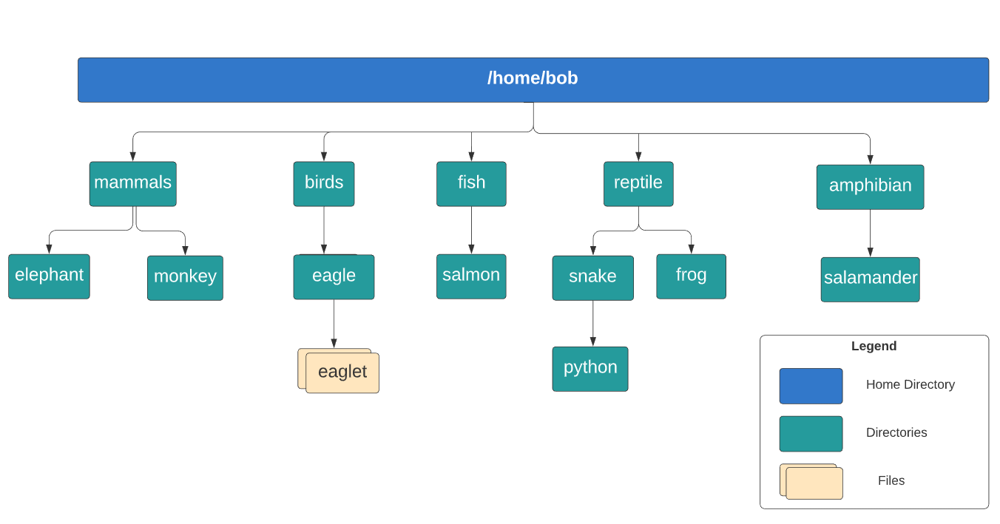

# **Linux Basics Commands**

This document covers basic Linux commands and concepts learned as part of my DevOps prerequisites.

---

**`echo Hi`** -> Used to print on screen  

**`ls`** -> list files and folders  

**`cd`** -> change directory -> e.g: **`cd my_dir`**  

**`pwd`** -> present working directory  

**`mkdir`** -> make new directory. E.g: **`mkdir new_dir`**  

---

## **Commands Directories**

To run multiple commands in one line separate it by **`;`**.  
For example: **`cd new_dir; mkdir www; pwd`**

To create more than one directory (**`/tmp/asia/india/bgr`**) instead of going 3 times  
(**`mkdir /tmp/asia`**, **`mkdir /tmp/asia/india`**, **`mkdir /tmp/asia/india/bgr`**)  
we can create these in one line:

**`mkdir -p /tmp/asia/india/bgr`**

To remove a directory use: **`rm -r /tmp/my_dir`**

To copy the directory from one location to another:  
**`cp -r my_dir1 /tmp/my_dir1`**

---

## **Commands for Files**

To create a new file: **`touch newfile.txt`**

To enter content in the file use: **`cat > newfile.txt`**

After this you can enter the content you want to add in the file and to add next line just hit enter button.  
And when you want to end the file hit **Ctrl + D**

To view the contents of file type: **`cat newfile.txt`**

To copy the file type: **`cp new_file.txt copy_file.txt`**

To move (rename) a file type: **`mv new_file.txt sample_file.txt`**

Remove (delete) a file: **`rm new_file.txt`**

---

## **Copy target file to target directory**

**Target file name:**  
**`/home/thor/asia/bangalore.txt`**

**Target directory:**  
**`/home/thor/asia/india/bangalore`**

**`cp -v /home/thor/asia/bangalore.txt /home/thor/asia/india/bangalore`**

---

## **More Linux Commands**

### **User Accounts**

To know which user you are run: **`whoami`**

This command: **`id`** – it gives more info about the user like user id, group id & groups the user is part of.

To switch user: **`su laxmi`** – SU stands for switch user to laxmi

If you are using one system from another system using say ssh & you want to login to other system using a different user than your current user.  
Here specify the user name before the hostname followed by **`@`** symbol.

**`ssh vijaya@192.168.1.2`**

When it comes to linux users not all users have access to everything.  
Lets say there is a user vijaya who is a normal user, she will have restricted access.

Every linux system has a super user known as **Root user**, they will not have any restrictions and can perform any tasks.

If any normal user want to do some root user operations like view some certain paths or installing s/ws,  
the Root user can make that possible by giving the sudo privileges by making entry to **`/etc/sudoers`**

Now the normal user can do tasks which can be done by root user, by prefixing the word **`sudo`** in front of the command.  
For example: **`sudo ls /root`**

After entering this the system will ask password and then it will execute the command.

---

## **Download files**

Commands that help us to download files from the internet such as rpm packages, binary files and images.

**`curl https://www.example.com/some-file.txt -o some-file.txt`**  
Here **`-o`** is used to save the file locally, if you don’t add **`-o`** then it will print the file on screen.

You can use this command also:

**`wget http://www.example.com/some-file.txt -O new-file.txt`**  
Here **`-O`** is used to save the file in local machine.

---

## **Check OS versions**

To check the current OS type: **`ls /etc/*release*`**

To view more OS files type: **`cat /etc/*release*`**

# ** Hands-on Linux Commands for practice

1. **Create a tarball** of the directory called python and **compress it using gzip.**

The compressed tar file should be available at **/home/bob/python.tar.gz.**

***Note: If you see a message like tar: Removing leading '/' from member names, it's just a warning and can be safely ignored.***

Use this image for reference:

In command prompt type:

**`tar -cf /home/bob/python.tar /home/bob/reptile/snake/python`**

You will then get a message like this: tar: Removing leading `/' from member names

Then type: **`gzip /home/bob/python.tar`**

2. There is a compressed file called **eaglet.dat.gz** located under the **/home/bob/birds/eagle** directory.

**Extract** it in the same location.

**`gunzip /home/bob/birds/eagle/eaglet.dat.gz`**

3. Bob stored the caleston-code file somewhere in /opt folder. can you find it?

**`sudo find /opt -name caleston-code`**

It will ask you for the user's pwd provide the pwd and the location of the file will be displayed.

4. Find the **location of the file called dummy.service within the /etc filesystem** and redirect its absolute path to the file located at **/home/bob/dummy-service.**

You can use the redirect operator with the echo command to save the answer to the file.

Run the command **`sudo find /etc -name dummy.service.`**

Then, use the command **`echo /etc/systemd/system/dummy.service > /home/bob/dummy-service.`**

5. Find the file under **/etc** directory that contains the string **172.16.238.197.** Save the answer using the absolute path in the **file /home/bob/ip.**

Run this command: **`sudo grep -ir 172.16.238.197 /etc/ > /home/bob/ip`**

6. Create a new file at the path **/home/bob/file_with_data.txt.** The content of this file should consist of a single line of text that states: **a file in my home directory.**

Make use of the **redirect(>)** operator.

Run this command: **`echo "a file in my home directory" > /home/bob/file_with_data.txt`**

7. Run the command **python3 /home/bob/my_python_test.py** and redirect the standard error to the file **/home/bob/py_error.txt.**

The file /home/bob/my_python_test.py does not exist.
Focus on capturing the error message using the 2> operator.

Run the following command:
**`python3 /home/bob/my_python_test.py`**

You will get an error message because no such file exists. Now to save thos error message in a file execute the below command:

**`python3 /home/bob/my_python_test.py 2> /home/bob/py_error.txt`**

**python3 /home/bob/my_python_test.py** → tries to run a Python file (which doesn’t exist)
**2>** → redirects error output (stderr)
**/home/bob/py_error.txt** → file where the error message will be saved

8. Read the file **/usr/share/man/man1/tail.1.gz** and, without extracting it, redirect its contents to a file called **/home/bob/pipes.**

**`zcat /usr/share/man/man1/tail.1.gz | tee /home/bob/pipes`**