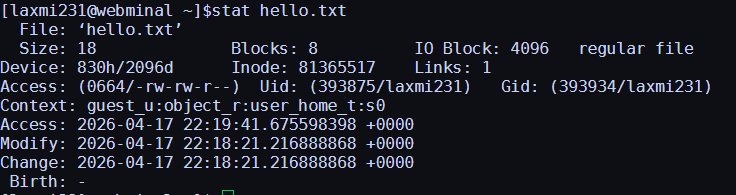
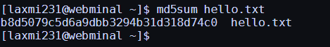
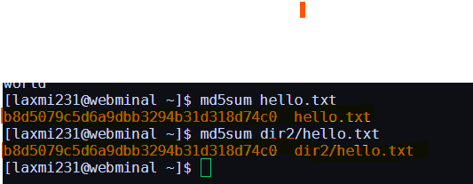
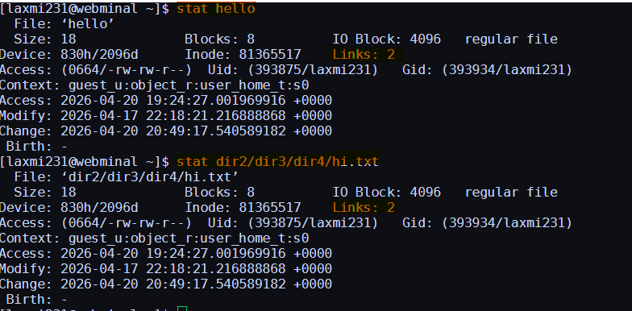

## *Basics of Linux:

## **Lesson 1: Basic commands to navigate directories

1. **`pwd`** to know in which directory you are working presently.

2. Now lets create a new directory. To do so enter the below command
**`mkdir -v dir1`**

You will see an output like this: **"mkdir: created directory dir1"**
## ***Note: It is not necessary to use "-v" you can use mkdir dir1. But here "-v" tells us what we did(mkdir: created directory dir1).

3. Lets say we want to create more than one directory instead of invoking mkdir multiple(three) times-like.
**`mkdir -v dir2`**
**`mkdir -v dir2/dir3`**
**`mkdir -v dir2/dir3/dir4`**

you can simply use **`mkdir -vp dir2/dir3/dir4`**

**"-p"** option will create parent directories for "dir4" as needed. In this case,it creates dir2,dir3 automatically.Now we have created 4 directories.How to view them?

To view type 'ls' and press enter
**`ls`**
listed dir1 dir2 as directory content right? But where did other 2 directories go. Because other 2 directories were created inside dir 2. you need to use "complex" command to view them. Try this:
**`ls -R`**

**-R** stands for recursive.

Now lets go inside the new directory dir2. For this type:
**`cd dir2`**

you have changed to dir2 Now confirm this location by using previously learned pwd command.To move into next directory dir3

**`cd dir3`**

4. **`cd ..`** will move to parent directory.i.e dir2. or it goes one directory back.

5. Now type, **`cd -`** will move you to previous working directory i.e dir3

6. A simple **`cd`** will move to the your home directory.

That's it.You have successfully completed lesson1 Now to start next lesson.

## ** Lesson 2: Create files, display contents and stats

During Lesson1,you have learned how to create directories.

Lets learn to create a new file,

1. **`touch file1.txt`** and press enter key and read on :)

**touch** command will create a new file or change time stamp of an existing file. 

2. **`touch file2.txt`** will create an empty new file ,if the file is not already exists. 

3. To view directory contents ,you can also use: **` dir`** . **dir** is used to list directory contents.

4. To clear a screen,the command is **`clear`**

5. Let's print some message on the terminal, **`echo "hello"`**

The message will get printed on the cmd screen.🥳

6. Lets redirect the message to a new file instead of screen.
**`echo "hello" > hello.txt`**

## ***Note: To append data you must use >> not just >

**`echo "linux" >> hello.txt`**
**`echo "world" >> hello.txt`**

7. To view the file content ,do **`cat hello.txt`**
**cat** is used to display the entire file content.

8. To view only first two lines from the file **`head -2 hello.txt`**
By default,**head** will display the first 10 lines when you run,**`head hello.txt`**

9. Now how to view last two lines?.Its simple,use **tail**
**`tail -2 hello.txt`**
Thus **head** will be used to display **lines from begining** and **tail** will be used to display **last few lines.** As with head **`tail hello.txt`** by default will display last 10 lines from the line.

10 Lets check some stats of the files and directories we have create so far.
**`stat hello.txt`**
carefully examine few important fields the output. 

-> The first line shows the **filename** .second line says its a **regular file** with size as **18.**
-> Third line shows **Inode** number and no.of **links** to that inode.
-> Fourth one,says **owner(Uid),group(Gid)** who has read-write permission but other have read permission. Final three lines show **access,modified and change time.**. They mean:

| Term     | Description |
|----------|------------|
| Access   | When the file was last accessed/read |
| Modified | When the contents were last modified/written |
| Change   | Changes to file metadata (e.g., permissions) |

Now lets do a **stat** on directory.

**`stat dir1`**

Compare the previous **stat** "hello.txt" output with "dir1",before you move. especially find out "dir1" type.

## *** Lesson 3:  Copy,rename,delete files

 Now lets learn general file operations.

Now check this command

1. **`du`**

title: du

it displays the disk usage of current directory.(Please note the current total of du output).

2. **`du -xh ~`**

Use the h switch to output in a human readable format and the x switch to exclude other file systems and ~ denotes your home.

3. Now lets *copy* hello.txt to dir2 directory.

**`cp -v hello.txt dir2`**

## **Tips and tricks:

4. **`cp -v hello.txt dir2/file2.txt`**
This will copy hello.txt into dir2 at the same time, rename it as "file2.txt".

5. **`cp  -vr dir2/*.txt dir2/dir3`**
This will copy all files ending with ".txt" from dir2 into dir2/dir3.

6. **`cp -vr dir2/dir3  .`**
This will copy the directory named "dir3" to current directory.

Use **ls**,it should show you dir3.

now we have copied few files,how do we verify its file integrity?simple **cat** should be enough.But If its large file or binary file,we can't use cat.We have to use,

7. **`md5sum hello.txt`**
title: md5sum

b8d5079c5d6a9dbb3294b31d318d74c0 is the calculated checksum for a file.This helps with detecting accidental or deliberate file corruption.

When transfering a file from machine to another or downloading files from internet,to verify the file integrity compare md5sum on source and destination machines,

8. **`md5sum dir2/hello.txt`**
should be same as **md5sum hello.txt**

9. **`mv hello.txt dir2/dir3/dir4/hi.txt`**
It will move a file into directory **dir4** and names it as **hi.txt.**

## ***Note: When you use cp there exists two copies of a file (similar to copy-paste "ctrl-c" and "ctrl-v") with mv there is one copy (its cut-paste ctrl-x and ctrl-v). unlike (cp,rm) other commands mv don't need "-r" for directories.

create a new directory dir5 **`mkdir dir5`**

now

**`mv dir2/*.txt dir5`** -> will move all "*.txt" files under dir2 into dir5.
**`mv dir5  dir50`** -> rename the directory "dir5" as "dir50".

with **mv** command we moved **hello.txt** under **dir4**,instead of accessing them as **dir2/dir3/dir4/hi.txt** everytime,we can create a **link** and after that,you can **access or edit dir2/dir3/dir4/hi.txt** file as simply **hello**

10. **`ln dir2/dir3/dir4/hi.txt hello`**

Great! you have created a link. There are **two** types of links, **hardlinks.** where a same inode pointed by two different names and **softlinks** which work more like shortcuts.

**Hard links** are created by **default.**

11. **`stat hello`** or **`stat dir2/dir3/dir4/hi.txt`**
both uses same inode and link count shown as 2

**Soft links** are created using the **s** switch.
12. **`ln -s dir2/dir3/dir4/hi.txt softlink`**

Now you do **`stat softlink`**

examine its output.New inode is created for this new symbolic link "softlink" but link count remains as 1.

To remove individual file use
13. **`rm -i file2.txt`**
will prompt you with a message.**rm: remove regular empty file 'file2.txt'?** type **y** to delete the file.

To remove directory, first remove it's contents using option "r",
**`rm -ri dir50/*`**

If you want to remove files content without begin prompted for confirmation use **-f** option. It's extremely **dangerous** to use **"rm -rf"**,because you may delete very important files by mistake-so make sure you delete correct files before running **rm -rf"**

**`rm -rf junk/*`**
**`rmdir  dir50`**