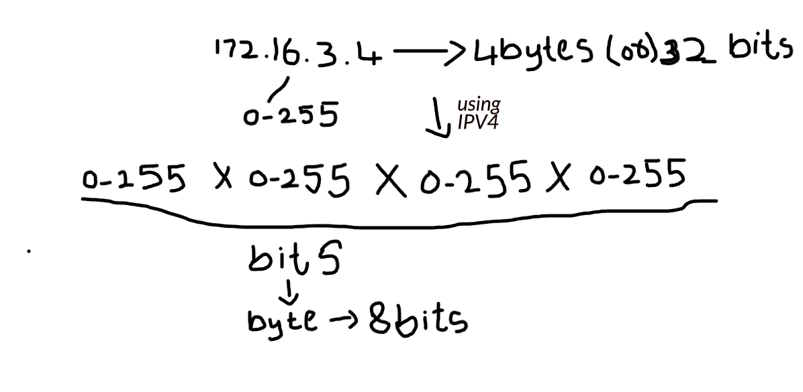
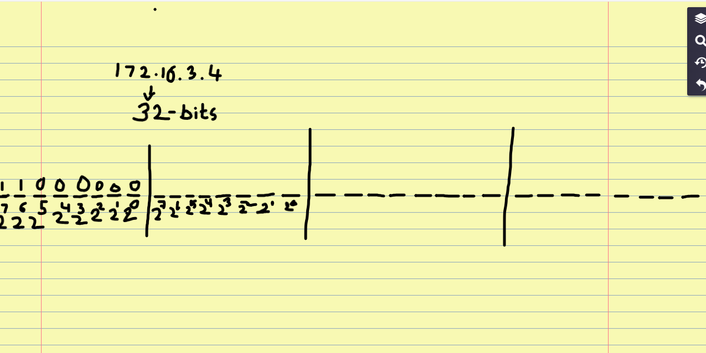

# **Networking Basics**

The first topic we will learn in Networking basics is **IP Address**.

## **IP Address:**

- It is used to generate or provide an **unique address** to a particular device that is connected to your **Network**. 

- Lets understand what is IP Address in simple example: 
" Lets say in you home you have a wifi Network created for a router and it is connected to 4 devices in you home. You want to monitor one of those devices and block them from using Instagram, but if each of these devices don't have any unique number, you will end up blocking IG on all the devices. So to avoid this type of situations, all the devices shoould have unique Identification number that is **IP Adress**.

- To generate unique address for each device there is standard called "**IPV4**" so using IPV4 huge number of IP adresses can be generated. 

- Using IPV4 you can generate an IP address lets say for example: 172.16.3.4

- If you see you have the IP address with numbers seperated by "**.**" here the advantage is each of these numbers is genrated between "**0-255**". 

So you can say why it generates between 0-255 not 0-1000, it is because the computers only understand **bits**
because computers it doesn't understand numbers it only understand **bits**. 
- So each of this number is 1 byte(8 bits). Then the overall IP address is "**4-bytes or 32-bits**" and each byte seperated by a **.** dot.

- This is the standard used to create IP address that is **IPV4 standard**.

- Since computer doesn't understand we convert it into bits. That is 32 bits so we will give convert them into 0's and 1's. Example is given below screenshot:

## **Subnets**

Imagine a company requests a **VPC with 65,000 IP addresses** to run its applications, servers, and internal systems. All resources—such as employee systems, application servers, databases, and services—are placed inside this single large network.

Now, suppose one system in this network accidentally connects to a **malicious website** created by a hacker. Since **all 65,000 IP addresses belong to the same network**, there is no isolation between resources.This means the attacker could potentially move across the network and access:

- Financial data
- Employee records
- Internal applications
- Banking and confidential information

To prevent such incidents, the large VPC is divided into smaller networks called **subnets.**

A **subnet** splits the VPC’s IP address range into **smaller, controlled blocks,** each used for a specific purpose. 
For example:

- One for employees
- One for Finance team
- One for databases
- One for public-facing applications

If **one IP address** in a subnet is compromised, the attacker’s access is **restricted to that subnet,** and critical resources in other subnets remain protected.

Assume a company requests a VPC with around 65,000 IP addresses.

In AWS, this usually means:

CIDR block: 10.0.0.0/16

/16 gives 65,536 IP addresses (≈ 65K)

👉 This is your main network (VPC).

Now since the company wants to divide this VPC into two subnets:

Finance team subnet → needs 256 IP addresses

Employee (free usage) subnet → uses the remaining IPs

We cannot randomly assign IPs.
So we use something called CIDR.

CIDR (Classless Inter-Domain Routing) tells:

- How many IP addresses a subnet will have
- Which part of the IP stays fixed
- Which part can change

This is for lets say Finance team: **10.0.0.0/24**

**/24** means 24 bits are fixed

Remaining 8 bits can change

So total IPs = **2^8 = 256**

**Step 1:** Total bits in an IP address

An IPv4 address has **32 bits.**

Example:
10.0.0.0
= 8 bits . 8 bits . 8 bits . 8 bits
= 32 bits total

**Step 2:** What does /24 mean?

/24 means:

- 24 bits are fixed (network part)
- Remaining bits can change (host part)

So:
32 − 24 = 8 bits
and 2 power 8 = 256
These 8 bits are used for hosts (IP addresses).

**Step 3:** How many IP addresses do we get?

Formula:
Total IPs = 2^(number of host bits)

Here:

2^8 = 256 IP addresses

So:

10.0.0.0/24 → 256 IPs

The IP range is:

10.0.0.0  
10.0.0.1
10.0.0.2
...
10.0.0.254
10.0.0.255 

Generally **subnets** are of 2 types: 
1. Private --> These subnets don't have direct access to internet
2. Public  --> These subnets have direct access to internet

