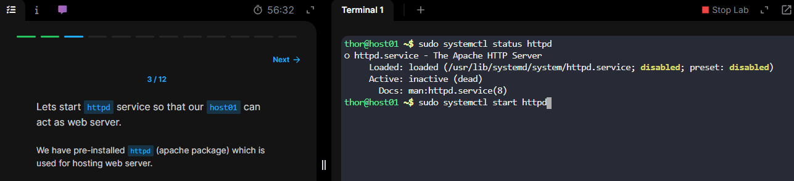
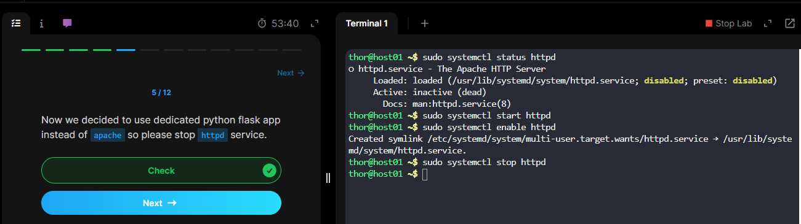
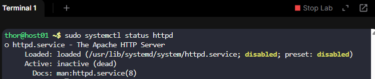
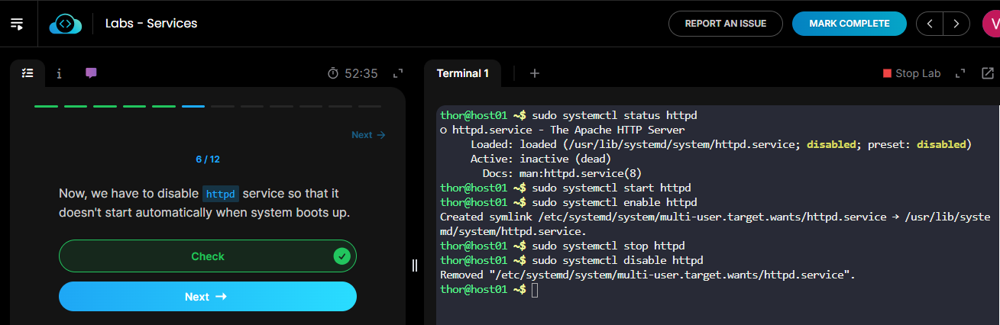
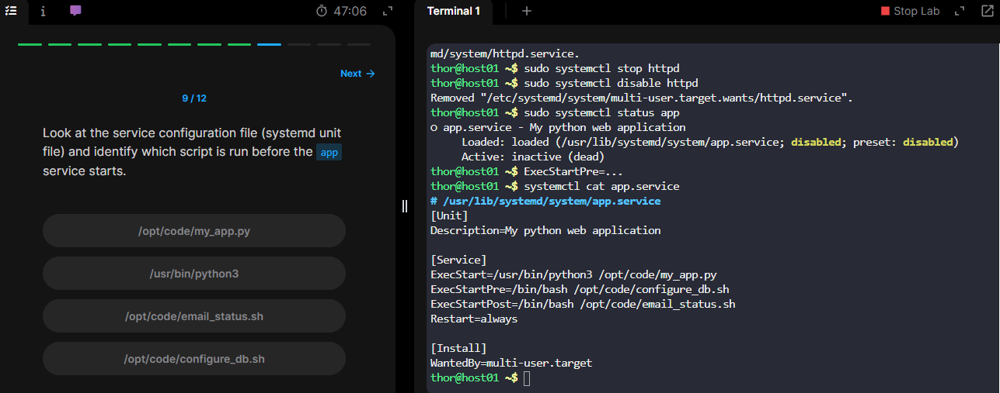

## **Package Managers:**

These helps us to install various software in linux system.

Centos uses RPM based package manager just like red hat enterprise linux or fedora.

**RPM – Redhat Package Manager**

A software is packaged into a bundle with an extension **.rpm**, to install the package use rpm command **-i** to install and specify package name.rpm

Install package: **rpm –i telnet.rpm**

Uninstall Package: **rpm –e telnet.rpm**

Query package(to get detailes about installed package): **rpm –q telnet.rpm**

RPM requires you to point you to exact location where the rpm package is available, you then install, it doesn’t care about any dependencies this package may have. Like for example you are installing ansible but for that you will need python but simply installing python it will not download any dependencies.

You will need a rpm that can query the package, find its locations, install all dependencies as well as its package itself. To make this more efficient **YUM** comes into picture. It is a high level package manager that uses rpm underneath. Commands are:

Install Package: **yum install ansible** - it will install the package along with the dependencies.

To know the no. Of repos in the system run this: **yum repolist**

To knpw available package type: **yum list ansible**

To remove the the package: **yum remove ansible**

To see the available versions of package: **yum –showduplicates list ansible**

---

## **Servers:**

Once you install the software on servers especially those run in the background such as web servers, database servers, you need to make sure that the servers/services are running and stay running even after the servers are rebooted.

**Services** in Linux help you configure the software and make sure they run all the time automatically when the servers are rebooted, as well as they follow the right order of start-up.

When any software that runs as a service in the background is installed such as web servers, database servers, or devops tools such as dockers, they are automatically they are automatically configured as a service on the system.

To start that service you run the service start command and providing the service name which happens to be httpd in this case:

**sudo service httpd start** -> starts the httpd service or you can use the newer command that is below

**sudo sytemctl start httpd** -> starts httpd service

**sudo systemctl stop httpd** -> stops httpd service

**sudo systemctl status httpd** -> check the status of a service

**sudo systemctl enable httpd** -> configure httpd to start automatically when the system reboots

**sudo systemctl disable httpd** -> configure httpd not to start at startup(to disable the service)

Once services are configured it is so convenient to the administrators to start, stop or enable the services

---

## **How to configure a program or software as a Service:**

Lets say we have a simple app.py program. It is in **/opt/code/myapp.py** location.

Normally what we do is run this code in interpreter or we type: **curl http://localhost:5000** and we will get the output. Now lets configure this as a service, so the program starts when you run the systemctl commands like **systemctl start my_app**, **systemctl stop my_app**. 

These **systemctl** helps to automatically run the app when rebooted or when the app is crashed.

Systemctl commands is used to manage the systemd services, so we must configure our program as a systemd service.

A systemd service is configured using the systemd unti file, these files maybe located at **etc/systemd/system** path

Lets create a unti file at: **etc/systemd/system** location, the file must be name that you evetually the service to be known as.

In this case we will name it as **my_app.service** :

In this file define a service using the **[]** and provide a directive name **ExecStart** name under it. Below is example:

**[Service]**
**ExecStart = /usr/bin/python3 /opt/code/my_app.py**

That’s it your service is completed. Now run the below commands:

**systemctl daemon-reload** --> let the system know there is new service configured & run

**systemctl start my_app** --> starts the service.

**systemctl status my_app** --> check status of new service(it will show you the status that is running)

Then you can excute this command: **curl http://localhost:5000**

Run: **systemctl stop my_app** --> to stop the service

---

## **Enable Service at Boot:**

But how do we configure it to make it automatically run when the system boots up. Lets see below:

We can configure that in **unit file(my_app.service)**. And the unit configuration file has many other options. **[Service]** section is one of the main sections and the other is **[Install]** section.

We need to configure the service to run after after the particular service that runs at bootup. One way to specify that is using **WantedBy** directive, we can configure the service to run after the multi-user target level is started. Once this is done you can configure the service to start during the bootup using the **systemctl enable my_app** command.

In **my_app.service** file:

[Unit]
Description=My python web application

[Service]
ExecStart= ExecStart = /usr/bin/python3 /opt/code/my_app.py

[Install]
Wanted.By=multi-user.target

If the service you want to run as any pre and post dependencies, or scripts you need to specify the exact pre and post path:

**ExecStartPre=/opt/code/configure_db.sh**
**ExecStartPost=/opt/code/email_status.sh**

If you want your service to restart in case it crashes specify the **Restart** directive and sepcify its value **=always**
Restart=always

To check the service configuration file you can use this command to know what is run when: **systemctl cat app.service** --> You will get to know which are all the options in Service file.

